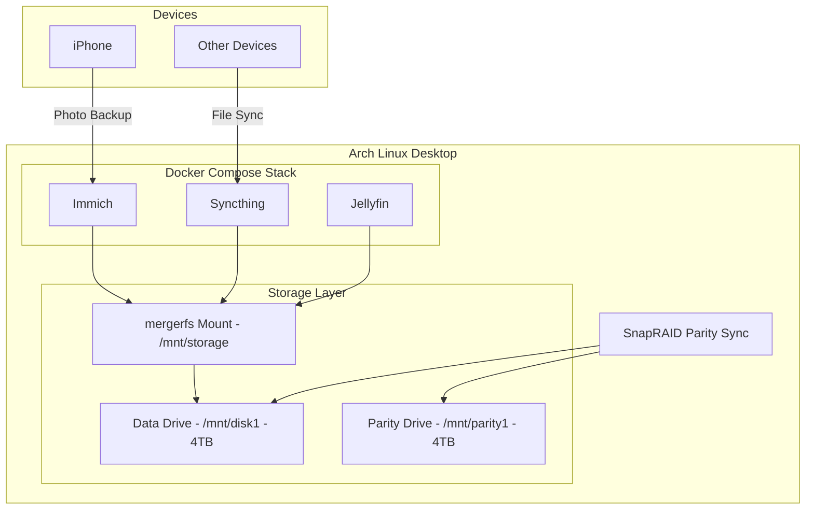

# Home Server Setup: Storage + Immich + Syncthing

## Architecture Overview



---

## Phase 1: Storage Setup (mergerfs + SnapRAID)

### 1.1 Identify and Prepare Drives

Identify the 2x 4TB HDDs:

```bash
lsblk -o NAME,SIZE,MODEL,SERIAL
```

Partition each drive with a single partition using GPT:

```bash
sudo parted /dev/sdX mklabel gpt
sudo parted /dev/sdX mkpart primary ext4 0% 100%
```

Format both drives with ext4:

```bash
sudo mkfs.ext4 -L disk1 /dev/sdX1    # Data drive
sudo mkfs.ext4 -L parity1 /dev/sdY1  # Parity drive
```

### 1.2 Create Mount Points and fstab Entries

Create mount directories:

```bash
sudo mkdir -p /mnt/disk1 /mnt/parity1 /mnt/storage
```

Add to `/etc/fstab` (using labels for reliability):

```
LABEL=disk1    /mnt/disk1    ext4 defaults 0 2
LABEL=parity1  /mnt/parity1  ext4 defaults 0 2
```

### 1.3 Install and Configure mergerfs

Install mergerfs from AUR:

```bash
yay -S mergerfs
```

Add mergerfs mount to `/etc/fstab`:

```
/mnt/disk1 /mnt/storage fuse.mergerfs defaults,allow_other,use_ino,cache.files=partial,dropcacheonclose=true,category.create=mfs 0 0
```

Note: With one data drive, mergerfs provides a consistent mount point that will seamlessly expand when you add more data drives later.

### 1.4 Install and Configure SnapRAID

Install SnapRAID:

```bash
yay -S snapraid
```

Create `/etc/snapraid.conf`:

```
parity /mnt/parity1/snapraid.parity
content /var/snapraid/content
content /mnt/disk1/.snapraid.content
data d1 /mnt/disk1
exclude *.unrecoverable
exclude /tmp/
exclude /lost+found/
exclude .Trash-*/
exclude *.partial
```

Create content directory:

```bash
sudo mkdir -p /var/snapraid
```

### 1.5 Set Up SnapRAID Automation

Create a cron job or systemd timer to run SnapRAID sync daily. A simple approach is a nightly cron:

```bash
# /etc/cron.daily/snapraid-sync
#!/bin/bash
snapraid sync
snapraid scrub -p 5
```

---

## Phase 2: Immich Setup

### 2.1 Create Directory Structure

```bash
mkdir -p /mnt/storage/immich/upload
mkdir -p /mnt/storage/immich/library
```

### 2.2 Create Immich Environment File

Create `.env.immich` in [/home/vowusu/Work/home-server/](/home/vowusu/Work/home-server/):

```env
DB_PASSWORD=your_secure_password_here
DB_USERNAME=postgres
DB_DATABASE_NAME=immich
UPLOAD_LOCATION=/mnt/storage/immich/upload
IMMICH_VERSION=release
```

### 2.3 Add Immich Services to docker-compose.yml

Add to existing [docker-compose.yml](/home/vowusu/Work/home-server/docker-compose.yml):

```yaml
  immich-server:
    container_name: immich_server
    image: ghcr.io/immich-app/immich-server:${IMMICH_VERSION:-release}
    volumes:
      - ${UPLOAD_LOCATION:-/mnt/storage/immich/upload}:/usr/src/app/upload
      - /etc/localtime:/etc/localtime:ro
    env_file:
      - .env.immich
    ports:
      - 2283:2283
    depends_on:
      - immich-redis
      - immich-database
    restart: unless-stopped

  immich-machine-learning:
    container_name: immich_machine_learning
    image: ghcr.io/immich-app/immich-machine-learning:${IMMICH_VERSION:-release}
    volumes:
      - immich-model-cache:/cache
    env_file:
      - .env.immich
    restart: unless-stopped

  immich-redis:
    container_name: immich_redis
    image: redis:6.2-alpine
    restart: unless-stopped
    healthcheck:
      test: redis-cli ping || exit 1

  immich-database:
    container_name: immich_postgres
    image: tensorchord/pgvecto-rs:pg14-v0.2.0
    environment:
      POSTGRES_PASSWORD: ${DB_PASSWORD}
      POSTGRES_USER: ${DB_USERNAME}
      POSTGRES_DB: ${DB_DATABASE_NAME}
    volumes:
      - immich-pgdata:/var/lib/postgresql/data
    restart: unless-stopped
    healthcheck:
      test: pg_isready -U ${DB_USERNAME} -d ${DB_DATABASE_NAME} || exit 1
```

Add volumes at the end of the file:

```yaml
volumes:
  immich-pgdata:
  immich-model-cache:
```

---

## Phase 3: Syncthing Setup

### 3.1 Create Directory Structure

```bash
mkdir -p /mnt/storage/syncthing/data
mkdir -p /mnt/storage/syncthing/config
```

### 3.2 Add Syncthing to docker-compose.yml

```yaml
  syncthing:
    container_name: syncthing
    image: syncthing/syncthing:latest
    hostname: home-server
    environment:
      - PUID=${PUID:-1000}
      - PGID=${PGID:-1000}
    volumes:
      - /mnt/storage/syncthing/config:/var/syncthing/config
      - /mnt/storage/syncthing/data:/var/syncthing/data
    ports:
      - 8384:8384   # Web UI
      - 22000:22000/tcp  # TCP file transfers
      - 22000:22000/udp  # QUIC file transfers
      - 21027:21027/udp  # Discovery
    restart: unless-stopped
```

---

## Phase 4: Update Setup Script

Update [setup.sh](/home/vowusu/Work/home-server/setup.sh) to create all required directories and handle the new services.

---

## Phase 5: Deployment and Verification

1. Mount all drives: `sudo mount -a`
2. Verify mergerfs: `df -h /mnt/storage`
3. Run initial SnapRAID sync: `sudo snapraid sync`
4. Start all services: `docker-compose up -d`
5. Access Immich at `http://localhost:2283` and create admin account
6. Access Syncthing at `http://localhost:8384` and configure
7. Install Immich iOS app and connect to server
8. Install Möbius Sync (iOS Syncthing client) if needed

---

## Final Directory Structure

```
/mnt/
├── disk1/                    # 4TB data drive
│   ├── immich/
│   ├── syncthing/
│   ├── jellyfin/
│   └── .snapraid.content
├── parity1/                  # 4TB parity drive
│   └── snapraid.parity
└── storage/                  # mergerfs mount point
    ├── immich/
    ├── syncthing/
    └── jellyfin/
```

---

## Post-Setup: iPhone Configuration

1. **Immich**: Install Immich app from App Store, enter server URL, enable background backup
2. **Syncthing**: Install Möbius Sync from App Store for file sync (paid app, $5)